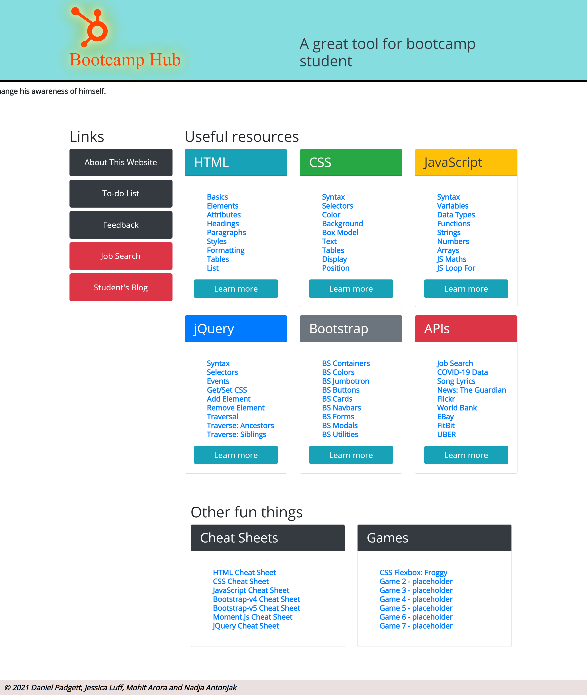

README

# bootcamp-hub
Creating a Project that applies the knowladge of html, css, javascript and Api's to create a responsive website that can help students keep on top of their work and organised.

Project team-

1. [Daniel Padgett](https://github.com/danpadge16)
2. [Jessica Luff](https://github.com/JessLuff)
3. [Mohit Arora](https://github.com/marora7926)
4. [Nadja Antonjak](https://github.com/nadjaantonjak)


## WHAT WAS YOUR MOTIVATION ?

```

```

## WHY DID YOU BULID THIS PROJECT?

```

```

## WHAT PROBLEMS DOES IT SOLVE?

```

```

## WHAT DID YOU LEARN ?

```

```

## WHAT MAKES YOUR PROJECT STAND OUT ?

```

```

## User Story

```

```

## Acceptance Criteria

```

```
## Deployed link

https://marora7926.github.io/bootcamp-hub/

## Wireframe - Bootcamp-Hub


## Screenshot - Landing page



## Screenshot - To-do list page


## Screenshot - Feedback page


## Screenshot - Job Search page


## Screenshot - Student blog page


- - -
© 2021 Bootcamp students. Confidential and Proprietary. All Rights Reserved