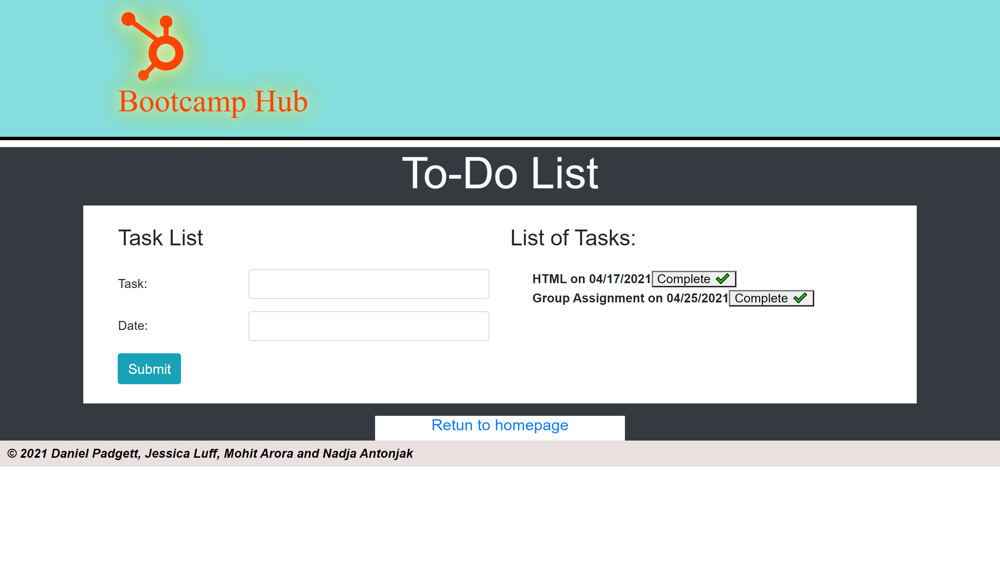

README

# Bootcamp-hub
Creating a Project that applies the knowladge of html, css, javascript and Api's to create a responsive website that can help students keep on top of their work and organised.

Project team-

1. [Daniel Padgett](https://github.com/danpadge16)
2. [Jessica Luff](https://github.com/JessLuff)
3. [Mohit Arora](https://github.com/marora7926)
4. [Nadja Antonjak](https://github.com/nadjaantonjak)


## WHAT WAS YOUR MOTIVATION ?

```
The strong teamwork between our group is what motivated everyone in the group throughout the whole of Project-1. Being supportive of one another and learning off each other was an extremely rewarding part of this project. We could rely on each other and always knew that if we did not understand a particular thing or needed guidance that we were not alone and could depend on each other.

```

## WHY DID YOU BULID THIS PROJECT?

```
This project was designed and developed in order to help Bootcamp users stay organised and on top of important work, as well as being able to seek employment once completing the course. We worked together as a team to combine our skills and passions for different parts of the project to showcase our result.

```

## WHAT PROBLEMS DOES IT SOLVE?

```
Our project helps keep users organised, on track and motivated in current time as well as in future helping achieve future life goals. The quick links provided make it easy for users to access important sources which are used by web developers daily. This saves time from constantly having to search links up in the web individually as it quickly directs you to what you are after by clicking one simple link. A Inspirational Quotes section is also put in place to inspire users through any other hardships they are facing in life, we all know everyone needs a little boost to get going at times. A To-Do-List is provided for users to acess. Creating a list will showcase users with what needs to be completed, leaving them satisfied once completing their set goals. Aswell as this the website provides many other links to sources such as games and cheats to certain codes in order to provide support to users in their learning and development, hopefully helping them excel in all aspects.
```

## WHAT DID YOU LEARN ?

```
Throughout this project along with implementing and advancing skills we learnt in class, we believe the most important thing we learnt was how to complete the project together as a team. 
Working in a team abled us to learn how to 
-Each put out issues and assign different parts of our project to different contributor. 
-Each contributor creating their own branch and requesting pulls.
-How to approve work done by different contributors, resulting in their work being approved and pushed up to main branch.

```

## WHAT MAKES YOUR PROJECT STAND OUT ?

```
We believe our Project-1 (Bootcamp-Hub) is set to stand out due to the clear and functional display it contains. Quality is at the core of our reputation, this website is executed to the accessibility standards and attention to detail. It also gives bootcamp users an opportunity to access the useful resources in their own time as they are presented with a concise, functional and visually pleasing site that gives them easy links to all their studying needs. Users are given several options to engage with the site such as recording their future tasks which can help them manage their workload.
```

## User Story

```

AS AN Bootcamp student with access to Bootcamp hub Website
I WANT to access a useful website that meets criteria for different skills, where I can access updated date, time and weather report and apply for upcoming job ventures.
 In addition, supplying me with useful resources and providing me with quick link access to them if needed. As well as allowing me to develop a personal to-do-list in order to keep on track and on top of my work and opportunity to access other fun activities such as games and/or cheats I find to be beneficial to my learning.
SO I CAN stay organised with my work, progressing me further with my course and helping me stay on track to becoming successful.

```

## Acceptance Criteria

```
GIVEN an educational website for staying organised, advancing skills and strengthening existing knowledge of content learnt throughout the Bootcamp Course.
WHEN I land on Bootcamp Hub website,
THEN I am presented with todays date, time and current weather forecast, Links to JOB SEARCH, TO-DO LIST and FEEDBACK. As well as Useful resources and other fun thins including cheat sheets and games.
WHEN I click TO-DO LIST BUTTON,
THEN I am presented with a LIST i am able to assemble to match what i need to get done.
WHEN I click INSPIRATIONAL QUOTES BUTTON,
THEN I am presented with different inspriational quotes each time i refresh the page.
WHEN I click FEEDBACK BUTTON,
THEN I am presented with a feedback form, where I can provide my feedback about the website and provide it with a star rating.
WHEN I click each LINK under USEFUL RESOURCES,
THEN I am re-directed to a relevant webpage for that link, in a new window to access the useful resources provided.
WHEN I click on CHEAT SHEET LINKS,
THEN I am redirected to different web pages supplying me with cheat codes that could be beneficial to understanding the content.
WHEN I click on GAMES LINKS
THEN I am redirected to different games I can play to practice and advance my skills while effectively helping me repeat and understand content.


```
## Deployed link

https://marora7926.github.io/bootcamp-hub/

## Wireframe - Bootcamp-Hub


## Screenshot - Landing page


## Screenshot - To-do list page



## Screenshot - Job Search page


## Screenshot - Feebback page


- - -
© 2021 Bootcamp students. Confidential and Proprietary. All Rights Reserved
